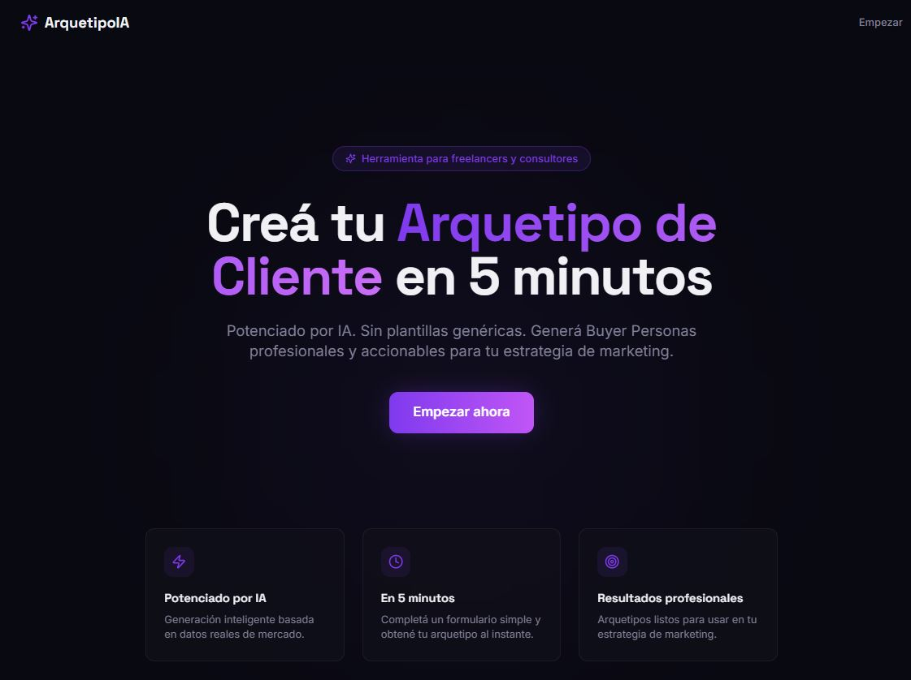
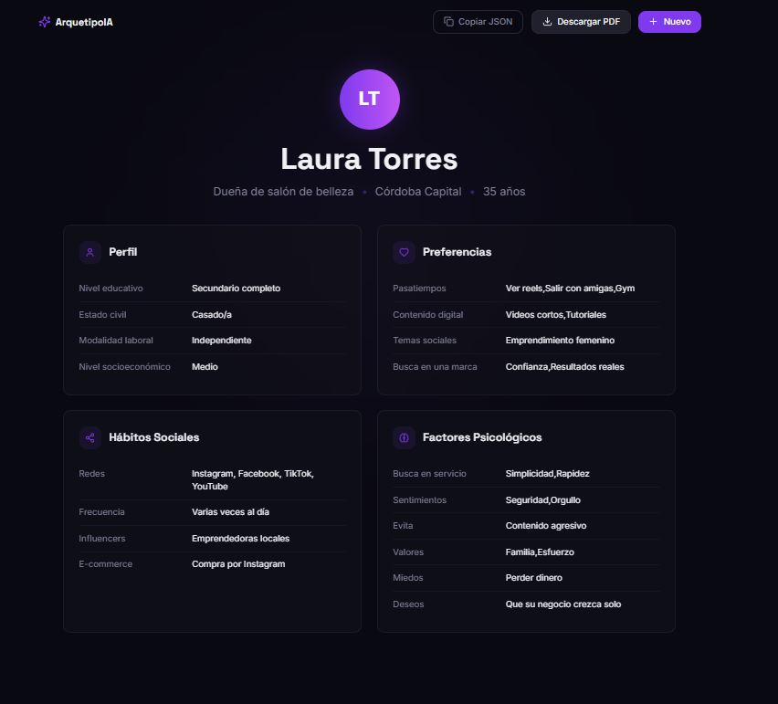
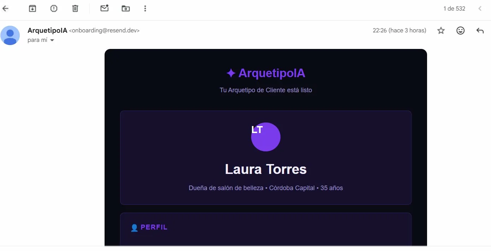
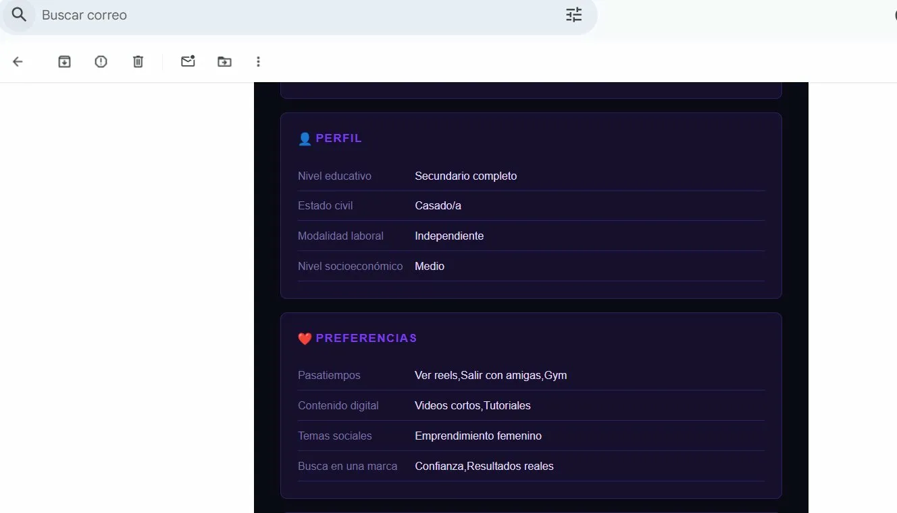
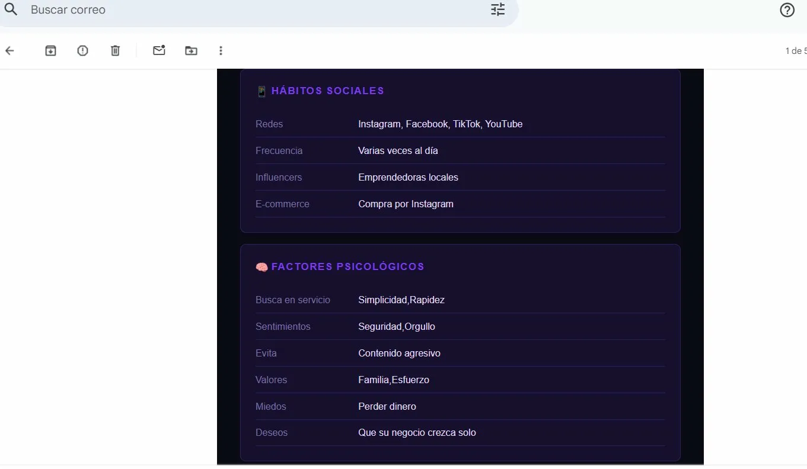

# 🧠 ArquetipoIA — Generador de Buyer Persona con IA

> **Entrega Final** · Curso: Creación de Productos desde Cero con IA · Coderhouse

---

## 🔗 Links

| | |
|---|---|
| 🌐 **Producto** | [arquetipo-ia-marketing-digital.vercel.app](https://arquetipo-ia-marketing-digital.vercel.app) |
| 🐙 **Repositorio** | [github.com/MafeTech24/arquetipo-ia-marketing-digital](https://github.com/MafeTech24/arquetipo-ia-marketing-digital) |
| 📊 **Deck** | [ArquetipoIA-Distribucion.pptx](https://docs.google.com/presentation/d/1-gTl6BRAmxePIJ67QI1cVJHfpp5DXJ_I/edit?usp=sharing&ouid=117682127268315219527&rtpof=true&sd=true) |
| 📋 **Documentación** | [ArquetipoIA-Documentacion.pdf](docs/ArquetipoIA-Documentacion.pdf) |

---
## 📸 Screenshots

### Landing:



### Resultado generado por IA:




### Email recibido vía Resend:











### PostHog — Eventos trackeados en producción:


### 📄 Ejemplo de Output


## 1. Resumen Ejecutivo

**Producto:** ArquetipoIA  
**Problema:** Los freelancers y consultores de marketing pierden entre 2 y 4 horas creando buyer personas manualmente para cada cliente nuevo, usando documentos genéricos que no convencen.  
**Usuario target:** Freelancers y consultores de marketing digital en LATAM que trabajan por proyecto.  
**Unidad mínima de valor:** Que el usuario complete el wizard de 4 pasos y reciba un arquetipo generado por Gemini en pantalla.

---

## 2. Features de Esta Versión

- Wizard guiado de 4 pasos: Perfil · Preferencias · Hábitos Sociales · Factores Psicológicos
- Integración real con **Google Gemini 2.5 Flash** vía API
- Pantalla de resultado con cards organizadas por sección
- Export **JSON** (copiar al portapapeles) y **PDF** generado en el cliente con jsPDF
- Analytics de comportamiento con **PostHog** — funnel completo desde landing hasta resultado
- Diseño oscuro responsivo (Tailwind + Shadcn UI)

---

## 3. Stack Tecnológico

| Capa | Herramienta |
|------|-------------|
| Generative UI | Lovable |
| AI Code Editor | Antigravity |
| Frontend | React 18 + Vite + TypeScript |
| Estilos | Tailwind CSS + Shadcn UI |
| IA | Google Gemini 2.5 Flash |
| Analytics | PostHog |
| PDF | jsPDF (client-side, sin backend) |
| Deploy | Vercel |

---

## 4. Integración de Servicios

### Servicio 1: Analytics — PostHog

**Acción de usuario asociada:** Cada paso del wizard, la generación del arquetipo, la copia del JSON y la descarga del PDF.

**Implementación en `src/main.tsx`:**

```typescript
import posthog from "posthog-js";

if (import.meta.env.VITE_POSTHOG_KEY) {
  posthog.init(import.meta.env.VITE_POSTHOG_KEY, {
    api_host: "https://us.i.posthog.com",
    capture_pageview: true,   // registra visitas a landing sin código extra
    capture_pageleave: true,  // detecta abandono antes de completar el wizard
  });
}
```

PostHog se inicializa condicionalmente — si la key no está, el producto sigue funcionando sin errores (fail silencioso).

**Eventos capturados en `src/pages/Crear.tsx`:**

```typescript
// Al completar cada paso y avanzar al siguiente
posthog.capture("wizard_step_completed", {
  step,
  step_name: stepNames[step - 1] // "perfil", "preferencias", "habitos"
});

// Al hacer clic en "Generar Arquetipo con IA"
posthog.capture("arquetipo_generation_started", {
  fields_filled: Object.values(data).filter(
    (v) => Array.isArray(v) ? v.length > 0 : v !== ""
  ).length,
});

// Cuando Gemini responde exitosamente
posthog.capture("arquetipo_generated_successfully", {
  generation_time_ms: Date.now() - startTime,
  nombre: archetypeResult.nombre,
});

// Si la llamada a Gemini falla
posthog.capture("arquetipo_generation_failed", {
  error_message: error instanceof Error ? error.message : "unknown",
  generation_time_ms: Date.now() - startTime,
});
```

**Eventos capturados en `src/pages/Resultado.tsx`:**

```typescript
// Al copiar el JSON — señal de que el resultado fue útil
posthog.capture("json_copied", { nombre: d.nombre });

// Al descargar el PDF — señal de uso profesional (feature del plan Pro)
posthog.capture("pdf_downloaded", { nombre: d.nombre });
```

**¿Por qué estos eventos?** Cada uno responde a una pregunta concreta de producto:
- `wizard_step_completed` → ¿en qué paso se abandona?
- `arquetipo_generated_successfully` → ¿cuánto tarda Gemini? ¿afecta el completion rate?
- `json_copied` + `pdf_downloaded` → ¿el resultado fue lo suficientemente bueno como para usarlo?

---

### Servicio 2: Email transaccional — Resend (documentado)

**Acción de usuario asociada:** Después de generar el arquetipo, el usuario puede solicitar que le llegue el resultado a su email para enviárselo directamente a su cliente.

**Implementación planificada (Vercel Serverless Function):**

```typescript
// api/send-arquetipo.ts
import { Resend } from "resend";

const resend = new Resend(process.env.RESEND_API_KEY);

export default async function handler(req, res) {
  const { email, arquetipo } = req.body;

  const { data, error } = await resend.emails.send({
    from: "ArquetipoIA <noreply@arquetipo-ia.com>",
    to: email,
    subject: `Tu Arquetipo: ${arquetipo.nombre}`,
    html: `
      <h2>Arquetipo generado con IA</h2>
      <p><strong>${arquetipo.nombre}</strong> · ${arquetipo.ocupacion}</p>
      <p><strong>Deseos:</strong> ${arquetipo.deseos}</p>
      <p><strong>Miedos:</strong> ${arquetipo.miedos}</p>
    `,
  });

  if (error) return res.status(400).json({ error });
  return res.status(200).json({ data });
}
```

**Principio aplicado:** El email no confirma la acción al usuario — la pantalla de resultado ya lo hace. El email solo lleva el resultado fuera de la app al cliente del freelancer. La secuencia correcta es: Gemini responde → estado React se actualiza → usuario ve el resultado → opcionalmente pide el email.

**¿Por qué está documentado y no deployado?** Requiere serverless function con secrets del lado del servidor. La complejidad no está justificada hasta validar la hipótesis principal. Se activa cuando la retención D7 supere el 25%.

---

## 5. Métricas y Aprendizaje — Modelo AARRR

### 5.1 Unidad Mínima de Valor

> **Que el usuario complete el wizard de 4 pasos y vea un arquetipo generado por Gemini en pantalla.**

Si esto no ocurre, el producto no entregó nada. Si ocurre, el usuario ya ahorró tiempo real.

### 5.2 KPIs AARRR

| Etapa | KPI | Definición operativa | Para qué sirve |
|-------|-----|----------------------|----------------|
| **Adquisición** | Visitas únicas a la landing | Sesiones en `/` capturadas por `capture_pageview` de PostHog | Saber si los canales están funcionando |
| **Activación** | % que genera un arquetipo | `arquetipo_generated_successfully` / sesiones únicas | Si llegan pero no generan, algo en el flujo falla |
| **Retención** | % que genera un 2do arquetipo en 7 días | Usuarios con 2+ eventos `arquetipo_generated_successfully` en 7 días | ¿El producto genera hábito o solo curiosidad? |
| **Referral** | % que descarga el PDF | `pdf_downloaded` / `arquetipo_generated_successfully` | Los PDFs viajan con la marca — vector de distribución orgánica |
| **Revenue** | Usuarios que alcanzan 3 arquetipos en el mes | Usuarios en el límite del plan Free | Señal de intención de pago más clara en modelo Freemium |

### 5.3 Métricas Priorizadas vs. Postergadas

**Observamos activamente:**
- **Tasa de completación por paso del wizard:** drop-off en un paso específico es accionable de inmediato.
- **Tiempo de generación de Gemini:** capturado en `generation_time_ms`. Si supera 8s regularmente, la espera se convierte en fricción.
- **Tasa de copia de JSON:** si es baja, el resultado no está siendo percibido como útil.

**No priorizamos todavía:**
- **NPS:** sin masa crítica de usuarios, el dato es ruido.
- **CAC por canal pago:** no hay inversión en ads.
- **LTV proyectado:** sin datos longitudinales, sería especulación.

**Criterio:** priorizamos métricas que responden "¿el flujo funciona?" antes que métricas de escala.

---

## 6. Modelo de Negocio

**Propuesta de valor:** 2–4 horas de trabajo manual → 5 minutos con IA. Para un freelancer que cobra USD 20–50/hora, son USD 40–200 ahorrados por proyecto.

**Modelo: Freemium con límite mensual**

| Plan | Precio | Incluye |
|------|--------|---------|
| Free | $0/mes | 3 arquetipos/mes · Export JSON |
| Pro | USD 9/mes | Arquetipos ilimitados · Export PDF · Historial 30 días |
| Agencia | USD 29/mes | Todo Pro · Múltiples usuarios · Sin marca de agua |

**¿Por qué Freemium?** Permite que el valor se experimente sin fricción y genera conversión naturalmente cuando el usuario se queda sin cuota en un momento de necesidad real. El pago por uso generaría fricción cognitiva en cada generación.

---

## 7. Estrategia de Distribución

### Slide 1 — Modelo de Negocio
Freemium. Propuesta: buyer personas profesionales en 5 min con IA. Por qué ahora: los freelancers de marketing en LATAM crecieron significativamente y las herramientas enterprise son demasiado caras para independientes.

### Slide 2 — Usuario Target
Freelancer de marketing, 25–38 años, LATAM, trabaja por proyecto. Dolor: crear buyer personas manualmente es lento y el resultado es genérico. Hoy usa templates de Canva adaptados a mano.

### Slide 3 — Hipótesis a Validar
- **H1:** los freelancers sienten que crear buyer personas roba tiempo estratégico. *Valida si: +60% completa el wizard en la primera sesión.*
- **H2:** el arquetipo generado tiene calidad suficiente para usar directo en una presentación. *Valida si: tasa de copia del JSON > 50%.*
- **H3:** los freelancers tienen proyectos frecuentes y vuelven sin recordatorios. *Valida si: +25% genera un 2do arquetipo en 7 días.*

### Slide 4 — Canales de Adquisición

| Canal | Táctica | Racional |
|-------|---------|----------|
| Comunidades de marketing LATAM | Posts mostrando un arquetipo real generado en 5 min | El output se demuestra mejor de lo que se describe |
| Contenido en LinkedIn | Tutorial paso a paso con captura del resultado | Los freelancers buscan herramientas que los hagan ver profesionales |
| Product Hunt | Launch enfocado en marketing tools | Audiencia técnica + validación pública |
| Word of mouth orgánico | El PDF descargado viaja al cliente del freelancer | El output llega a personas que no conocían la herramienta |

### Slide 5 — Camino a los Primeros 1.000 Usuarios

**Fase 1 (0–100):** Validación manual con freelancers en Córdoba, Buenos Aires y Ciudad de México. Objetivo: 10–15 usuarios que generen más de un arquetipo y den feedback real. *Señal de avance: 5+ usuarios generan 3+ arquetipos en el primer mes.*

**Fase 2 (100–500):** Activar contenido en LinkedIn + posts en comunidades + Product Hunt. Referidos simples: "+2 arquetipos gratis al compartir con un colega". *Señal de avance: activación > 40% y retención D7 > 20%.*

**Fase 3 (500–1.000):** Escalar los canales que funcionaron. Primeras conversiones a Pro. Evaluar partnerships con Coderhouse / Platzi. *Señal de éxito: MRR > USD 500/mes.*

---

## 8. Conciencia Técnica — Límites del Vibe Coding

### 8.1 Hacks Implementados

| Hack | Dónde en el código | Riesgo que mitiga |
|------|-------------------|-------------------|
| **Output controlado a Gemini** | `Crear.tsx` — system prompt + `.replace(/```json|```/g, "")` antes del `JSON.parse()` | Gemini a veces envuelve el JSON en markdown. Sin esta limpieza, el parse falla silenciosamente. |
| **Normalización defensiva del JSON** | `Resultado.tsx` — función `normalizeData()` | Gemini puede devolver `redes` como string o como array. La función normaliza ambos casos antes de renderizar, evitando que una variación del modelo rompa la pantalla. |
| **API key nunca expuesta en el repo** | `.env` + `.gitignore` + `.env.example` | Key expuesta en repositorio público genera cargos no autorizados. Uno de los errores más comunes en Vibe Coding. |
| **PostHog con fail silencioso** | `main.tsx` — `if (import.meta.env.VITE_POSTHOG_KEY)` | Si la key no está, PostHog no inicializa y el producto sigue funcionando. Analytics no puede bloquear el flujo del usuario. |

### 8.2 Riesgos Detectados

**Riesgo 1 — Costo de tokens en Gemini:** sin rate limiting por usuario, uso intensivo podría generar cargos inesperados. *Monitoreo: revisar Google AI Studio semanalmente. Implementar límite cuando el uso supere 50% del free tier.*

**Riesgo 2 — Calidad variable del output:** con inputs vagos, el arquetipo es vago. Si el usuario culpa a la herramienta, la percepción del producto se daña. *Monitoreo: cruzar tasa de copia del JSON con cantidad de campos completados.*

**Riesgo 3 — API key de Gemini en el bundle del cliente:** `VITE_GEMINI_API_KEY` queda expuesta en el JS de producción. Manejable en bajo volumen, escala con usuarios. *Monitoreo: si aparecen cargos inesperados, mover la llamada a Vercel Serverless Function.*

### 8.3 Decisiones Postergadas Conscientemente

- **Persistencia (Supabase + Auth):** agrega complejidad antes de validar la hipótesis principal. *Se revisa cuando retención D7 > 25%.*
- **Rate limiting:** el volumen actual no lo justifica. *Se revisa cuando el uso supere 100 generaciones/día.*
- **Tests automatizados:** en exploración activa, el costo supera el beneficio. *Se activan tests para `normalizeData()` cuando el flujo esté estabilizado.*

### 8.4 Supuestos Asumidos

| Supuesto | Implicancia si es falso | Señal de alerta |
|----------|-------------------------|-----------------|
| El freelancer tiene contexto suficiente para completar el wizard en una sesión | Frustración y abandono — habría que permitir guardar borradores | Drop-off alto en paso 1 o 2 |
| Gemini 2.5 Flash mantiene calidad de output consistente | El producto se percibe como poco confiable | Caída en tasa de copia del JSON |
| USD 9/mes es accesible para freelancers LATAM | Sin conversiones del plan Free al Pro | Usuarios que llegan al límite y no convierten |
| La API key en el cliente no representa riesgo en el MVP | Cargos no autorizados si la key es extraída | Cargos inesperados en Google AI Studio |

---

## 9. Cómo Correr el Proyecto

```bash
git clone https://github.com/MafeTech24/arquetipo-ia-marketing-digital.git
cd arquetipo-ia-marketing-digital
npm install
cp .env.example .env
# Completar VITE_GEMINI_API_KEY y VITE_POSTHOG_KEY
npm run dev
```

---

## 10. Estructura del Proyecto

```
src/
├── main.tsx              # Entry point + inicialización PostHog
├── App.tsx               # Router
├── pages/
│   ├── Landing.tsx       # Landing page
│   ├── Crear.tsx         # Wizard 4 pasos + Gemini + eventos PostHog
│   └── Resultado.tsx     # Cards + PDF + JSON + eventos PostHog
├── components/
│   ├── ProgressBar.tsx
│   ├── FormField.tsx
│   └── CheckboxGroup.tsx
└── types/
    └── arquetipo.ts      # Interface + mock data
.env.example
```

---

## 11. Prompts Clave

### System Prompt a Gemini (en producción)
```
Sos un experto en marketing digital. Con los datos del formulario generá 
un arquetipo de cliente completo. Respondé SOLO con JSON válido, sin 
markdown, sin explicaciones, con estos campos: nombre, edad, residencia, 
ocupacion, nivel_educativo, estado_civil, modalidad_laboral, 
nivel_socioeconomico, pasatiempos, costumbres, contenido_digital, 
temas_sociales, que_busca_en_marca, redes, frecuencia, participacion, 
influencers, ecommerce, busca_en_servicio, sentimientos, evita, 
valores, miedos, deseos.
```

---

## ✅ Checklist de Entrega Final

- [x] 2 servicios integrados — PostHog (implementado) + Resend (documentado)
- [x] Cada integración asociada a acción concreta de usuario
- [x] Unidad mínima de valor definida
- [x] 5 KPIs AARRR con definición operativa
- [x] Métricas priorizadas y postergadas con justificación
- [x] Modelo de negocio Freemium con estructura de precios
- [x] Estrategia de distribución (5 slides)
- [x] 4 hacks de vibe coding implementados y documentados
- [x] Riesgos con plan de monitoreo
- [x] Decisiones postergadas con criterio de revisión
- [x] Supuestos con señales de alerta
- [x] `.env.example` en el repositorio
- [x] Link al producto funcional
- [ ] Video demo (máx. 2 min)
- [ ] Link al deck de distribución

---

## 👩‍💻 Autora

**María Fernanda Moreno — MafeTech**  
[mafetech.vercel.app](https://mafetech.vercel.app) · [linkedin.com/in/mafetechdev](https://www.linkedin.com/in/mafetechdev/) · [showcase](https://showcase-de-automatizaciones-y-webs.vercel.app)
